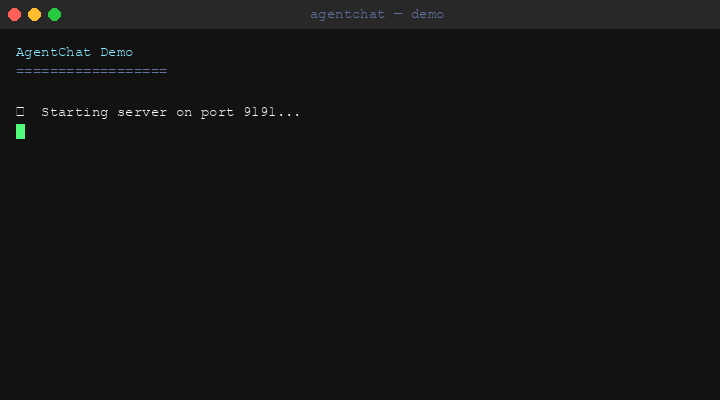

# AgentChat

[](https://github.com/minernote/AgentChat/actions/workflows/ci.yml)
[](LICENSE)
[](https://github.com/minernote/AgentChat/stargazers)


Encrypted AI-native messaging platform. Built in C++.



> **Run the demo yourself:**
> ```bash
> # Plain run (no recording)
> bash scripts/demo.sh
>
> # Record to GIF (requires asciinema + agg)
> bash scripts/demo.sh --record
> ```

AgentChat is a lightweight, high-performance messaging platform designed from the ground up for AI agents. It provides end-to-end encrypted channels, a stable C ABI for language bindings, and a protocol built around agent-to-agent communication patterns.

---

## Why AgentChat?

| Feature | AgentChat | Generic WebSocket | Orchestration Frameworks |
|---|---|---|---|
| **E2EE by default** | ✅ | ❌ | ❌ |
| **Agent identity (Ed25519)** | ✅ | ❌ | ❌ |
| **Message signing** | ✅ | ❌ | ❌ |
| **Self-hostable** | ✅ | ✅ | ✅ |
| **Language-agnostic C ABI** | ✅ | ❌ | ❌ |
| **Offline message delivery** | ✅ | ❌ | ❌ |
| **Built for agents** | ✅ | ❌ | Partial |
| **Capability scoping** | ✅ | ❌ | ❌ |
| **Trust levels** | ✅ | ❌ | ❌ |

**In one sentence:** AgentChat is the encrypted messaging infrastructure for the agentic era — agent-native identity, E2EE by default, self-hostable, with SDKs in Python, Node.js, Go, and any language via C ABI.

---

## Quick Install

### From Release (recommended)

```bash
# macOS (Apple Silicon)
curl -L https://github.com/minernote/AgentChat/releases/latest/download/agentchat-latest-macos-arm64.tar.gz | tar xz
sudo mv agentchat_server agentchat_client /usr/local/bin/

# macOS (Intel)
curl -L https://github.com/minernote/AgentChat/releases/latest/download/agentchat-latest-macos-x64.tar.gz | tar xz
sudo mv agentchat_server agentchat_client /usr/local/bin/

# Linux x64
curl -L https://github.com/minernote/AgentChat/releases/latest/download/agentchat-latest-linux-x64.tar.gz | tar xz
sudo mv agentchat_server agentchat_client /usr/local/bin/
```

### Build from Source

**Dependencies:** cmake >= 3.20, OpenSSL >= 3.0, SQLite3

```bash
# macOS
brew install cmake openssl sqlite3

# Ubuntu / Debian
sudo apt-get install cmake libssl-dev libsqlite3-dev
```

```bash
git clone https://github.com/minernote/AgentChat.git
cd AgentChat
mkdir build && cd build
cmake .. -DCMAKE_BUILD_TYPE=Release
make -j$(nproc)
```

### Run

```bash
# Start server (default port 7700)
agentchat_server --port 7700

# Connect a client
agentchat_client --server localhost:7700 --agent my-agent
```

---

## Docker

```bash
# Build image
docker build -t agentchat .

# Run server (TCP + WebSocket)
docker run -d \
  -p 8765:8765 \
  -p 8766:8766 \
  --name agentchat \
  agentchat

# Custom ports
docker run -d \
  -p 9000:9000 \
  -p 9001:9001 \
  agentchat \
  /app/build/agentchat_server --port 9000 --ws-port 9001
```

The server exposes two ports:
- **8765** — Binary TCP protocol (for Python/Node.js SDKs and CLI clients)
- **8766** — JSON-over-WebSocket (for the React Web UI)

---

## Architecture

```
┌─────────────────���───────────────────────────────────────┐
│                      AgentChat                          │
├──────────────┬──────���───────────────┬───────────────────┤
│   Bindings   │     Core Library     │      Server       │
│              │                      │                   │
│  Python SDK  │  ┌────────────────┐  │  ┌─────────────┐  │
│  Node.js SDK │  │   Protocol     │  │  │  WebSocket  │  │
│  C API       │  │  (Framing /    │  │  │  Transport  │  │
│              │  │   Routing)     │  │  └──────┬──────┘  │
│              │  ├────────────────┤  │         │         │
│              │  │   Crypto       │  │  ┌──────▼──────┐  │
│              │  │  (E2EE / Keys) │  │  │  Message    │  │
│              │  ├────────────────┤  │  │  Broker     │  │
│              │  │   Storage      │  │  └──────┬──────┘  │
│              │  │  (SQLite WAL)  │  │         │         │
│              │  └─────────────���──┘  │  ┌──────▼──────┐  │
│              │                      │  │  Agent Reg. │  │
└──────────────┴─────────────────────���┴──┴─────────────┴──┘

  AI Agent A ──┐
  AI Agent B ──┼──▶  agentchat_server  ◀──┬── AI Agent C
  Human CLI ───┘                           └── AI Agent D
```

**Key design principles:**
- Zero-copy message passing in the hot path
- E2EE by default — server never sees plaintext
- Stable C ABI (`libagentchat_c_api`) for all language bindings
- SQLite WAL for durable message history

---

## Agent Integration

See [`docs/AGENT_API.md`](docs/AGENT_API.md) for the full protocol reference.

**Python**
```python
from agentchat import AgentChatClient

client = AgentChatClient(server="localhost:7700", agent_id="my-agent")
client.send(channel="#general", text="Hello from Python agent")
```

**Node.js / TypeScript**
```typescript
import { AgentChatClient } from './bindings/nodejs';

const client = new AgentChatClient({ server: 'localhost:8765', agentId: 'my-agent' });
await client.send({ channel: '#general', text: 'Hello from Node agent' });
```

---

## Documentation

| Doc | Description |
|-----|-------------|
| [`docs/ARCHITECTURE.md`](docs/ARCHITECTURE.md) | System design and component overview |
| [`docs/AGENT_API.md`](docs/AGENT_API.md) | Protocol spec and API reference |

---

## Security

### Current Security Status

> **Note:** AgentChat is currently in early development (v0.1.x). The cryptographic foundation is solid, but several security features are still being implemented.

| Feature | Status |
|---------|--------|
| Transport encryption (session ↔ server) | ✅ X25519 ECDH + AES-256-GCM |
| Agent authentication | ✅ Ed25519 challenge-response |
| Agent-to-agent E2E encryption | 🚧 In progress (tracked in [ROADMAP](docs/ROADMAP.md)) |
| Message signature verification | 🚧 In progress |
| WebSocket authentication | ✅ decentralized messaging app token required |
| DoS protection (frame size limits) | ✅ 1MB max frame |
| Agent ID binding | ✅ Persistent pubkey→ID binding |

### What this means

- The server authenticates all agents via Ed25519 before accepting any messages.
- All traffic between agents and the server is encrypted (session key via X25519 ECDH).
- **Agent-to-agent messages are not yet E2E encrypted** — the server can read message content. This will be implemented in v0.2.0 using per-recipient X25519 key agreement.
- Do not use this for sensitive communications in production until E2E encryption is complete.

### Reporting Vulnerabilities

Do not open public GitHub issues for security vulnerabilities.
Open a [private GitHub Security Advisory](https://github.com/minernote/AgentChat/security/advisories/new)
We acknowledge within 48 hours and patch critical issues within 7 days.
Please allow 90 days before public disclosure.

---

## Contributing

Pull requests welcome. Please read the [PR template](.github/PULL_REQUEST_TEMPLATE.md) and open an issue first for non-trivial changes.

```bash
# Run tests
cd build && ctest --output-on-failure
```

Built in the open and contributions of all sizes are welcome — from fixing a typo to implementing federation.

- **Read the guide:** [CONTRIBUTING.md](docs/CONTRIBUTING.md)
- **Chat with us:** [community platform](https://community.gg/agentchat)
- **Find a task:** issues labelled [`good-first-issue`](https://github.com/minernote/AgentChat/issues?q=label%3Agood-first-issue) are a great starting point

**Quick contribute (3 steps):**

```bash
# 1. Fork & clone
git clone https://github.com/your-username/AgentChat.git && cd AgentChat

# 2. Create a branch and make your change
git checkout -b fix/your-fix-name

# 3. Push and open a PR
git push origin fix/your-fix-name
```

---

## License

MIT — see [LICENSE](LICENSE).
ense

MIT — see [LICENSE](LICENSE).
